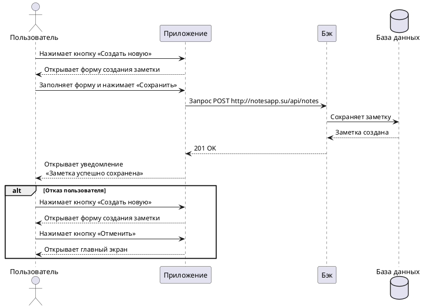

# Диаграмма последовательности

--8<-- "source:portfolio"

# --8<-- [start:dia]

```puml
@startuml
actor Пользователь as user
participant Приложение as client
participant Бэк as server
database "База данных" as db

user -> client: Нажимает кнопку «Создать новую»
user <-- client: Открывает форму создания заметки
user -> client: Заполняет форму и нажимает «Сохранить»
client -> server: Запрос POST http://notesapp.su/api/notes
server -> db: Сохраняет заметку
server <-- db: Заметка создана
client <-- server: 201 OK
user <-- client: Открывает уведомление\n «Заметка успешно сохранена»

alt Отказ пользователя
user -> client: Нажимает кнопку «Создать новую»
user <-- client: Открывает форму создания заметки
user -> client: Нажимает кнопку «Отменить»
user <-- client: Открывает главный экран
end alt

@enduml
```
# --8<-- [end:dia]